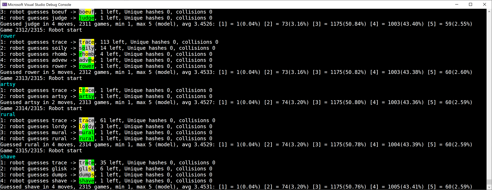

# Wordle tools

Chris Lomont (www.lomont.org)

Version 1.77245385....

Here is software to play and analyze the popular (as of Jan 2022) online word guessing game Wordle (https://www.powerlanguage.co.uk/wordle/).

The bot achieves under 3.5 moves on average over all 2315 possible games, solves all in 5 or less moves, and only about 2% use 5 moves.

There are a lot of analysis items, like starting word analysis, the ability to run the bot over all games in about 1 minute (multithreaded solver), and more.

Careful analysis went into the pieces to ensure the single and multithreaded items achieve the same results.

## Usage

Command line, options roughly explained. Read the code to see more.

Here's a screenshot of the bot finishing testing against all possible hidden words, using the starting word **TRACE** for each game. It averaged 3.4531 moves, solved all under 6 moves, and only 60 (2.59%) used 5 moves. You can start the both with any sequence of start words you want to test.

## How it works

For rules, search online.

Wordle has two word lists, a shorter one with 2315 words that are the possible hidden words, and a longer one with ~12000 words. Guesses are allowed from the short and long lists.

This program has a interactive game you can play against, a helper that helps you solve online puzzles, and a bot that runs against all possible words to analyze.

The helper and the bot use the same search ideas, which are:

1. At each point in time, the bot has some accumulated **knowledge** (`Knowledge.cs`) that represents the total of all moves played so far. This is represented internally by some clever bitfields to make future work as fast as possible, mostly for weeding out lists of possible words quickly to shrink the play space. The fields are 1) a bitfield to mark unused letters, 2) a bitfield to mark misplaced letters (these must occur in a word), 3) a bitfield with letter and indices of correct letters, and 4) a bitfield with letter and indices of misplaced items. Every word in the game has 1) a bitfield with letters used, and 2) a bitfield of letters and indices used. These combinations allow fast filtering with early cutoff.
2. At each move, the current knowledge is used to **filter** (`Knowledge.cs, Filter`) possible hidden answers. Every possible guess is **scored** against every possible answer by seeing how many possible hidden would be left using that guess, then taking the average size and the max size of those over all hidden (`Util.cs, ScoreAll`). Then the tuple of `(guess,avg,worst)` is sorted by selectable criteria. The best one so far is to sort on average, then on possible hidden words before other words, then on worst, then alphabetically. The last was required to make the outcome stable whether single or multithreaded. Scoring must match the original game, which is not well specified from the description, but is easy to test against posted games on the web, or more accurately, to reproduce from the original javascript code viewable in the page source.
3. The top scoring word is chosen, and the process is repeated.
4. The start word was chosen by a large search. The common start words on the internet chosen because how well they measure in some single move metric are all out-performed by many I have found (in results.txt). See the Results section below. This search was done on the top 500 words found by merging two common first word criteria: 1) one which leaves the smallest of the largest sizes of leftover words upon filtering, and 2) the ones with the best average first move result.

## Performance

To make the program decent performance for large searches, a few ideas are implmented

1. Lots of caching: word A to B is cached as they occur, the robot player caches computed second moves learned after first results, and a few other places.
2. bit tricks - these were used to speed up scoring and quick filtreing
3. multithreading - used to allow running many games in parallel, requiring careful total ordered sorts to make items repeatable

Currently the bot can test all 2315 starting words in about 1-2 minutes.

## Results

From the search of the top 500 expected good starting words, here is what I get testing over all 2315 possible starting words:

**TRACE** uses on average **3.4531** moves to win, always wins in 5 or less moves, and only needs 5 on **60 (2.59%)** games.

**RANCE** uses on average **3.4808** moves to win, always wins in 5 or less moves, and only needs 5 on **31 (1.34%)** games.

The bot currently defaults to **TRACE**.

## Start Strategy

I'm pretty sure no fixed two word start strategy is better than gaining knowledge from one guess, then using that to optimize the second choice. I tested many that would be expected to do ok, and all did worse than even poorly chosen single word starts.

You can prove that using more than one starting word, randomly selected, on average will do no better (and usually worse), than a single fixed word starting strategy.

## TODO

Lots can be improved. I am interested in getting all games solvable under 5 moves if possible.

The lowest hanging fruit is to do more multi-move scoring before choosing. This could be done often, since for most words the accumulated knowledge shrinks the space quit quickly. One way to do this is to filter both hidden words as impossible and guessable words as not providing more knowledge (which I experimented with - it's a bit messy).

I also tried modeling as many types of games: minimax 2 player, some adversarial statistical stuff, a few others, but each tuned out to be 1) computationally intractable, 2) hard to get a proper model, or 3) less performant than the current one.

## Building the code

Visual Studio 2022, C# 10.0, dotnet 6.

Stephen Heindel added VS Code support.

## 